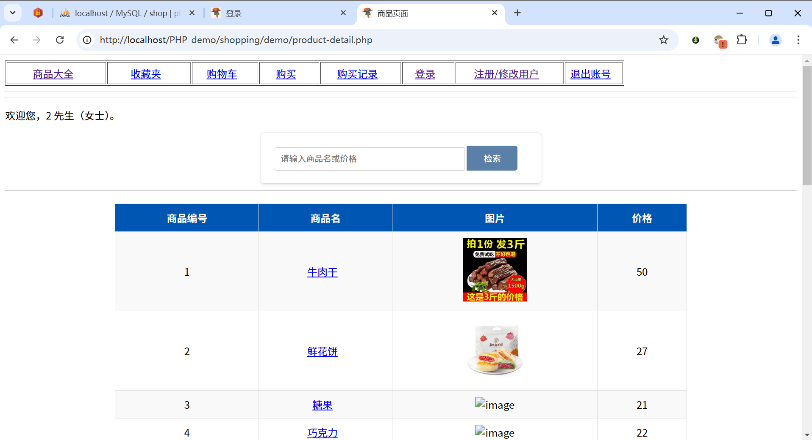

# Scarecrow-shop
- 本项目是为了完成学校期末作业所做（第一次接触 PHP）。我把该项目命名为：基于 PHP+MySQL 的商店管理系统。

- 简单做了个设计思路，目前按照该大纲进行编写（实际上有一些偏差，勿喷）：

**编译环境**

- [x] wampserver64 ：[Download Wampserver 64bits - WampServer](https://www.wampserver.com/en/download-wampserver-64bits/#download-wrapper)

- [x] PHP 版本 8.0 及以上：[PHP: Downloads](https://www.php.net/downloads.php)

浏览器输入： localhost: 80 

- [x] Visual Studio Code 或者 Zend Studio

  

  **注册界面** [界面不大好看呜呜呜~]

  

  **登录界面**

  *管理员账号和密码在数据库文件中*

  

  **首页-商品大全**

  
  
  
  
  注意：使用 wampserver64 需要的配置会有点多。你也可以用小皮面板等。不用另外下载 MySQL。如果下载了，MySQL 端口和 wampserver64 内置端口冲突，需要更改端口。端口默认为 3306。
  
  *如果你卡在环境配置，请再坚持一下，不要马上放弃，要清楚很多项目不是克隆就能直接打开使用的哈。*
  
  *CSDN ：qiapicoco*
